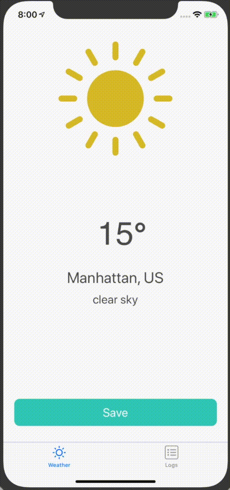
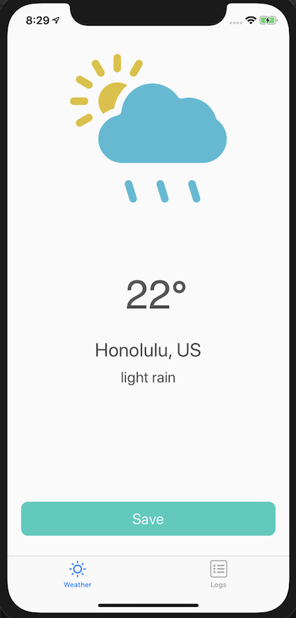
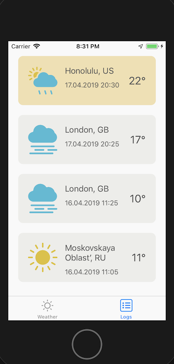

# Weather Logger

This project is built for a demo purposes.

## Getting started

1. Clone the project
2. Install pods

    ```bash
    # In project root directory
    pod install
    ```

3. Open the project workspace

## Features

* Weather tracking by user's current location;
* Persisting weather to Realm database;
* Updating an interface and making API requests in reactive way;
* Weather logs deleting;
* Displaying success/error notifications.

## The main flow



## Designs

### iPhone XR




### iPhone SE




## License

This project is licensed under the MIT License - see the [LICENSE.md](LICENSE.md) file for details

Weather images on the main screen are taken from http://www.freepik.com and designed by Titusurya / Freepik
